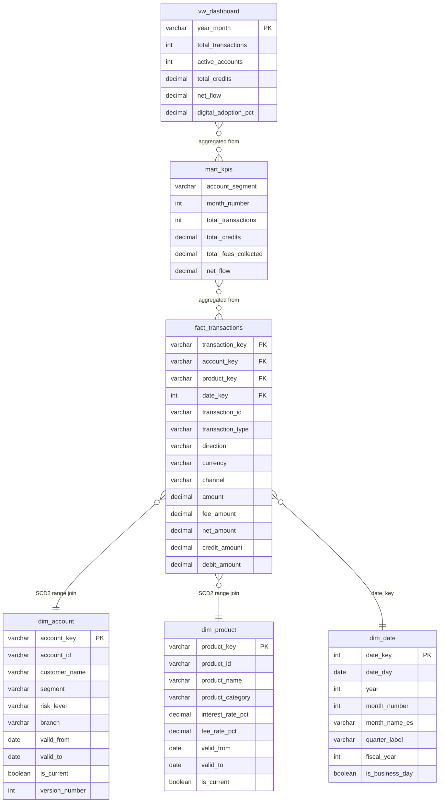

# ERD — Star Schema

```mermaid
erDiagram
  fact_transactions {
    varchar transaction_key PK
    varchar account_key FK
    varchar product_key FK
    int date_key FK
    varchar transaction_id
    varchar transaction_type
    varchar direction
    varchar currency
    varchar channel
    decimal amount
    decimal fee_amount
    decimal net_amount
    decimal credit_amount
    decimal debit_amount
  }
  dim_account {
    varchar account_key PK
    varchar account_id
    varchar customer_name
    varchar segment
    varchar risk_level
    varchar branch
    date valid_from
    date valid_to
    boolean is_current
    int version_number
  }
  dim_product {
    varchar product_key PK
    varchar product_id
    varchar product_name
    varchar product_category
    decimal interest_rate_pct
    decimal fee_rate_pct
    date valid_from
    date valid_to
    boolean is_current
  }
  dim_date {
    int date_key PK
    date date_day
    int year
    int month_number
    varchar month_name_es
    varchar quarter_label
    int fiscal_year
    boolean is_business_day
  }
  mart_kpis {
    varchar account_segment
    int month_number
    int total_transactions
    decimal total_credits
    decimal total_fees_collected
    decimal net_flow
  }
  vw_dashboard {
    varchar year_month PK
    int total_transactions
    int active_accounts
    decimal total_credits
    decimal net_flow
    decimal digital_adoption_pct
  }

  fact_transactions }o--|| dim_account : "SCD2 range join"
  fact_transactions }o--|| dim_product : "SCD2 range join"
  fact_transactions }o--|| dim_date : "date_key"
  mart_kpis }o--o{ fact_transactions : "aggregated from"
  vw_dashboard }o--o{ mart_kpis : "aggregated from"
```
